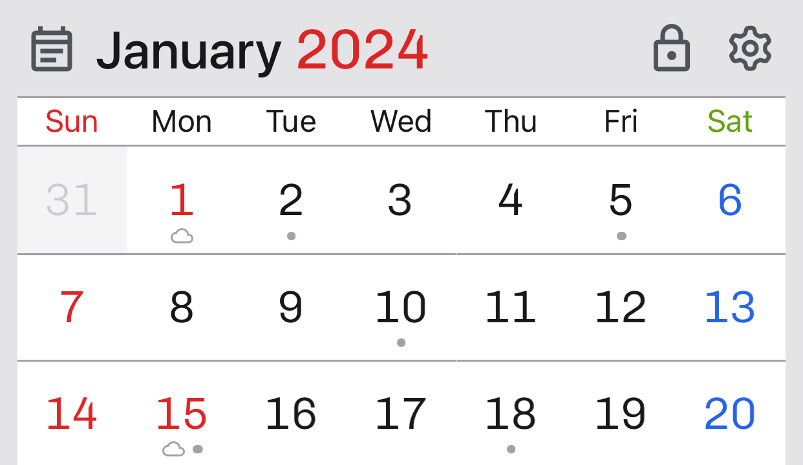
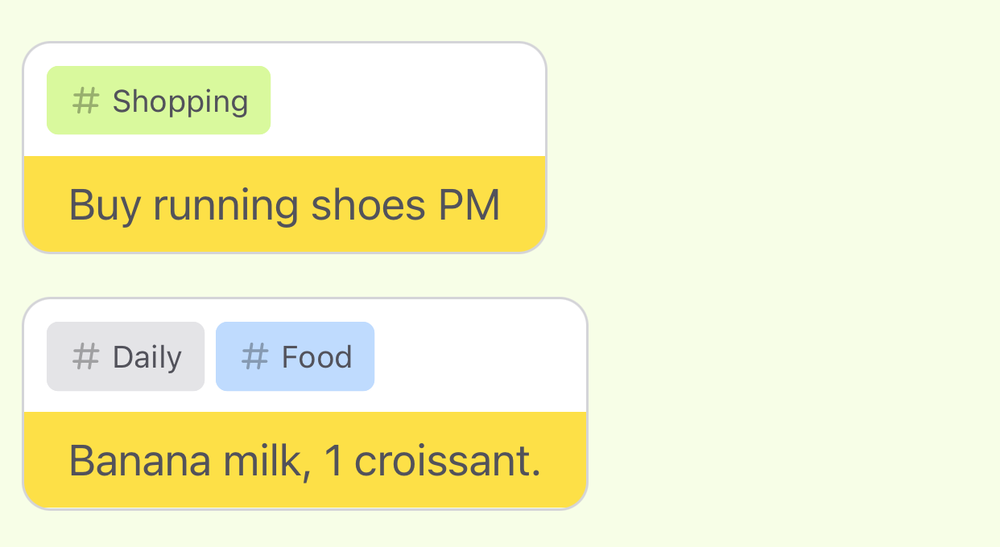
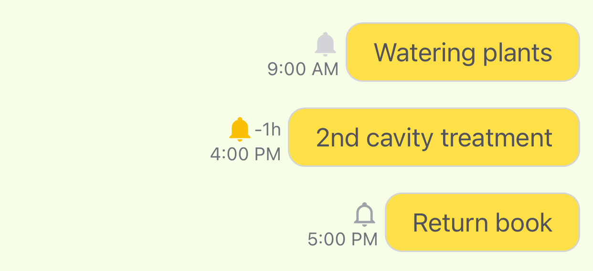
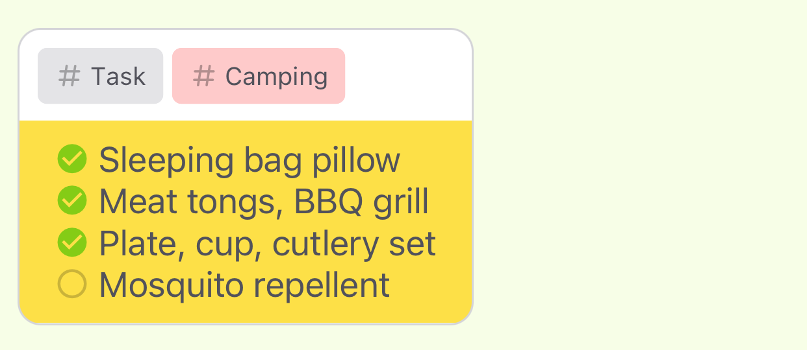
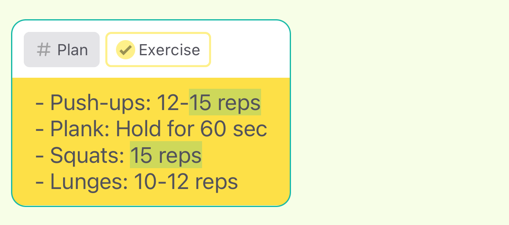
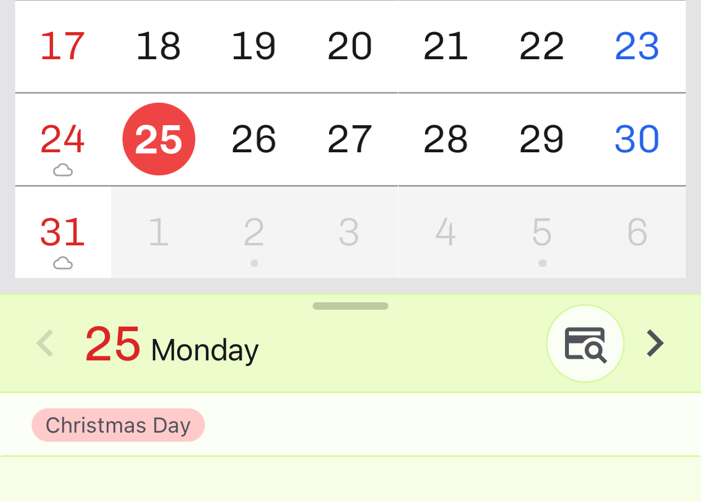

## Welcome!

Easily record and manage your personal notes!

**Haru Memo** is a powerful tool for writing notes by date and managing them systematically with features like tags, notifications, and counters. Now you can keep track of important schedules and notes all in one place.

---

## Key Features

1.  **Intuitive Note Management**  
    Create and edit notes anytime, managing your day with ease.

    

2.  **Flexible Tagging**  
    Add tags to your notes to categorize and search them easily.

    

3.  **Useful Counter Feature**  
    Apply counters to notes to track specific goals or recurring events.

    

4.  **Reliable Notifications**  
    Set notifications for individual notes to ensure you don’t forget important schedules.

    

5.  **Secure Secret Notes**  
    Protect important information with a password for added security.

    

6.  **Real-Time Checklists**  
    Create checklists to manage tasks and track completed items to achieve your goals.

    

7.  **Quick Search Function**  
    Easily search for notes using keywords to quickly find the information you need.

    

8.  **Date-Based Photo Viewing**  
    View photos taken on specific dates as thumbnails and collect all photos taken on a given date.

    

9.  **Convenient Schedule Viewing**  
    View all your schedules at a glance in the calendar and manage notes by date.

    

> Never forget important notes and schedules again. Find all the note-taking features you need in **Haru Memo**!

---

### 더 알아보기

자세한 기능 소개와 사용 방법은 [여기](support)에서 확인하세요.
